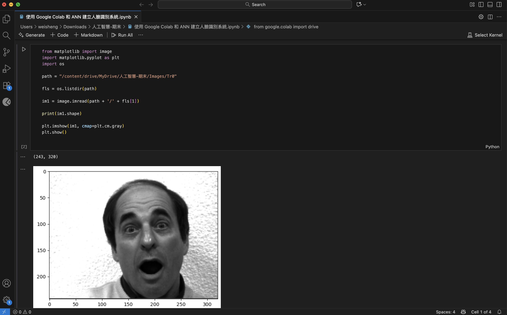
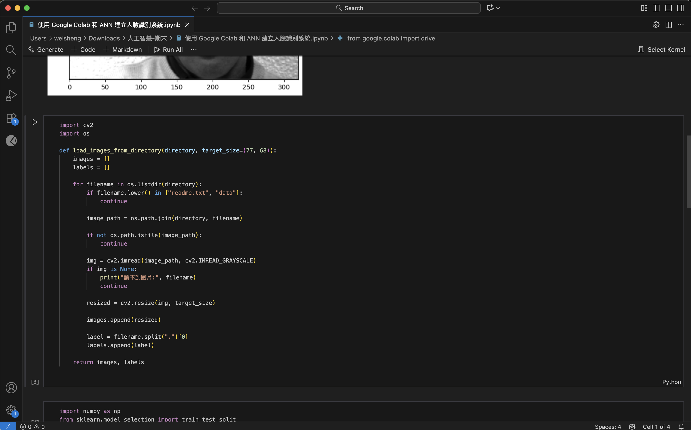
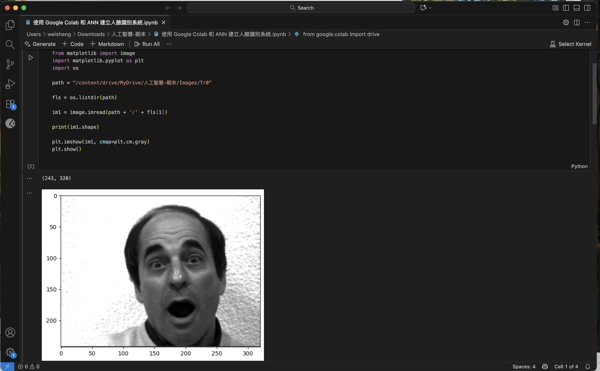

在人工智慧領域，人臉識別技術扮演著至關重要的角色。無論是智慧型手機的安全解鎖、社交媒體的照片標記，還是更複雜的安全監控系統，人臉識別技術都無處不在。本文將深入探討如何利用 Google Colab 這個強大的雲端平台，結合機器學習技術，打造一個高效且準確的人臉識別系統。我們將採用人工神經網路（Artificial Neural Network, ANN）作為核心模型，並詳細介紹資料準備、模型訓練、結果分析等關鍵步驟，讓讀者能夠全面了解並實踐人臉識別技術。
AD
tips
Amplift AI
Amplift AI
為精實團隊提供的終極成長與可見性引擎
立即嘗試
人臉識別的關鍵要點

Google Colab：免費的雲端平台，提供強大的運算資源。 智慧型手機
機器學習：利用演算法從大量資料中學習，進行人臉識別。
人工神經網路 (ANN)：模仿人類神經系統結構，適用於複雜的模式識別。
資料準備：收集、整理和預處理人臉圖像資料。
模型訓練：使用準備好的資料訓練 ANN 模型。
準確性：評估模型在識別人臉方面的效能。
圖像處理：了解如何處理和轉換圖像資料以供機器學習模型使用。
資料集：使用 Yale Face Database 或類似資料集進行人臉識別練習。
程式碼實作：提供 Python 程式碼範例，展示如何在 Colab 中實現人臉識別。
效能優化：探討如何提升模型的準確性和效率。
人臉識別技術詳解

什麼是人臉識別？

人臉識別是一種生物識別技術，旨在通過分析和比對人臉特徵來識別或驗證個體的身份。這項技術的核心在於能夠從圖像或影片中自動檢測、定位和辨識人臉。人臉識別的應用範圍極廣，從日常使用的手機解鎖到機場的安全監控，都能見到其身影。


人臉識別系統通常包含以下幾個主要步驟：
人臉檢測 (Face Detection)：在圖像或影片中自動尋找人臉的位置。
特徵提取 (Feature Extraction)：從檢測到的人臉中提取獨特的特徵，例如眼睛、鼻子和嘴巴之間的距離和比例。
人臉比對 (Face Matching)：將提取的特徵與資料庫中已知人臉的特徵進行比對。
身份驗證 (Identity Verification)：基於比對結果，確認或拒絕個體的身份。
隨著深度學習技術的發展，現代人臉識別系統的準確性和效率都得到了顯著提升，使得其在各個領域的應用更加廣泛和可靠。例如，在安全領域，人臉識別可用於身份驗證、門禁控制和犯罪偵查；在商業領域，可用於顧客身份識別、個性化服務和精準行銷；在醫療領域，可用於病人身份驗證、醫療影像分析和遠程醫療。總之，人臉識別技術不僅僅是一項生物識別技術，更是一種推動社會各領域發展的重要工具。機器學習與人工智慧
Google Colab 的優勢

Google Colab 是一個免費的雲端平台，特別適合用於機器學習和資料科學專案。它提供以下幾個顯著的優勢：
免費的運算資源：Colab 提供免費的 GPU 和 TPU 資源，這對於訓練大型機器學習模型至關重要。這使得研究人員和開發者能夠在沒有高昂硬體成本的情況下，進行複雜的運算。
預裝常用函式庫：Colab 預裝了許多常用的 Python 函式庫，例如 TensorFlow、Keras、PyTorch 和 OpenCV，省去了繁瑣的環境配置過程。

協作便捷：Colab 支援多人協作，方便團隊成員共同開發和修改程式碼。這使得團隊能夠更有效地協同工作，共同解決問題。
與 Google Drive 整合：Colab 可以直接讀取和儲存 Google Drive 中的資料，方便資料管理和模型儲存。這使得使用者能夠輕鬆地在 Colab 中存取和管理自己的資料。
易於使用：Colab 的介面簡單直觀，即使是初學者也能快速上手。這使得更多的人能夠參與到機器學習和資料科學的專案中來。
總之，Google Colab 是一個功能強大且易於使用的平台，為人臉識別等機器學習專案提供了理想的開發環境。無論是研究人員、開發者還是學生，都可以利用 Colab 的優勢，更輕鬆地實現自己的人工智慧想法。
人工神經網路 (ANN) 在人臉識別中的應用

人工神經網路（Artificial Neural Network, ANN）是一種模仿人類神經系統結構的機器學習模型。它由多層相互連接的節點（神經元）組成，每一層都對輸入資料進行轉換和傳遞，最終輸出結果。
在人臉識別中，ANN 能夠學習人臉圖像中的複雜模式和特徵。通過大量的訓練資料，ANN 可以自動提取人臉的關鍵特徵，並建立起人臉特徵與個體身份之間的映射關係。
ANN 在人臉識別中的應用主要分為以下幾個步驟：
輸入層 (Input Layer)：接收人臉圖像的像素資料。
隱藏層 (Hidden Layers)：多層隱藏層對輸入資料進行轉換和特徵提取。每一層都包含多個神經元，通過激活函數對資料進行非線性轉換。
輸出層 (Output Layer)：輸出識別結果，通常是對應個體身份的機率分佈。
ANN 的訓練過程涉及調整神經元之間的連接權重，以最小化模型預測與實際結果之間的誤差。常用的訓練演算法包括反向傳播演算法（Backpropagation）和梯度下降演算法（Gradient Descent）。
總之，人工神經網路在人臉識別中具有強大的學習能力和模式識別能力，能夠有效地處理複雜的人臉圖像資料，實現高準確性的人臉識別。通過不斷優化網路結構和訓練方法，可以進一步提升 ANN 在人臉識別中的效能。
實戰：使用 Google Colab 進行人臉識別

資料準備

在進行人臉識別之前，需要準備包含人臉圖像的資料集。常用的資料集包括 Yale Face Database、Labeled Faces in the Wild (LFW) 和 CelebA。對於初學者，Yale Face Database 是一個不錯的選擇，因为它資料量適中，易於處理。 

1.下載資料集：從 Yale Face Database 的官方網站下載資料集。
2.解壓縮資料集：將下載的 zip 檔案解壓縮到 Google Drive 的指定目錄中。
3.資料預處理：將圖像轉換為灰階圖像，並調整大小為統一的尺寸。這一步驟有助於降低計算複雜度，並提升模型的準確性。可以使用 OpenCV 等圖像處理函式庫來完成這些操作。

以下是一個使用 Python 和 OpenCV 進行資料預處理的程式碼範例：
```text
import cv2
import os

def preprocess_image(image_path, target_size=(77, 68)):
    # 讀取圖像
    img = cv2.imread(image_path)
    # 轉換為灰階圖像
    gray = cv2.cvtColor(img, cv2.COLOR_BGR2GRAY)
    # 調整大小
    resized = cv2.resize(gray, target_size)
    return resized

def load_images_from_directory(directory):
    images = []
    labels = []
    for filename in os.listdir(directory):
        if filename.endswith(".jpg"):
            image_path = os.path.join(directory, filename)
            # 預處理圖像
            processed_image = preprocess_image(image_path)
            # 提取標籤 (假設檔名包含標籤)
            label = filename.split(".")[0]
            images.append(processed_image)
            labels.append(label)
    return images, labels
```
import cv2 import os  def preprocess_image(image_path, target_size=(77, 68)): # 讀取圖像 img = cv2.imread(image_path) # 轉換為灰階圖像 gray = cv2.cvtColor(img, cv2.COLOR_BGR2GRAY) # 調整大小 resized = cv2.resize(gray, target_size) return resized  def load_images_from_directory(directory): images = [] labels = [] for filename in os.listdir(directory): if filename.endswith(".jpg"): image_path = os.path.join(directory, filename) # 預處理圖像 processed_image = preprocess_image(image_path) # 提取標籤 (假設檔名包含標籤) label = filename.split(".")[0] images.append(processed_image) labels.append(label) return images, labels
這個程式碼片段展示了如何讀取圖像、轉換為灰階圖像、調整大小，並從檔名中提取標籤。通過這些預處理步驟，可以將資料集準備好，以便用於訓練機器學習模型。科學
模型建立與訓練

使用人工神經網路 (ANN) 進行人臉識別涉及以下步驟：
1.導入必要的函式庫：
```text
import numpy as np from sklearn.model_selection import train_test_split from sklearn.neural_network import MLPClassifier from sklearn.metrics import classification_report, confusion_matrix
```
2.載入資料集：
```text
image_directory = "/content/drive/My Drive/Images/Tr0" images, labels = load_images_from_directory(image_directory) images = np.array(images) labels = np.array(labels)
```
3.分割訓練集和測試集：
```text
X_train, X_test, y_train, y_test = train_test_split(images, labels, test_size=0.2, random_state=42)
```
4.建立 ANN 模型：
```text
n_neurons = 200 # 設定隱藏層神經元數量 model = MLPClassifier(hidden_layer_sizes=(n_neurons,), solver='adam', activation='logistic', batch_size=1, verbose=True, early_stopping=True, random_state=42)
```
5.訓練模型：
```text
model.fit(X_train.reshape(X_train.Shape[0], -1), y_train)
```
6.模型準確性評估：
```text
使用交叉驗證評估模型效能是一個重要的步驟，它能幫助我們了解模型在不同資料子集上的表現，從而更全面地評估其泛化能力。以下是如何進行交叉驗證評估的程式碼範例：企業與生產力軟體
```
from sklearn.model_selection import cross_val_score  # 進行 10 折交叉驗證 cv_scores = cross_val_score(model, X_train.reshape(X_train.shape[0], -1), y_train, cv=10)  # 印出每次驗證的準確度 print("交叉驗證準確度：", cv_scores)  # 印出平均準確度與標準差 print("平均準確度：", cv_scores.mean()) print("準確度標準差：", cv_scores.std())
這段程式碼使用
```text
cross_val_score
```
函數，將訓練資料集分成 10 個子集，每次使用其中 9 個子集進行訓練，並用剩下的 1 個子集進行驗證。這樣重複 10 次，每次都使用不同的子集進行驗證，最終得到 10 個準確度分數。通過分析這些分數，我們可以更全面地了解模型的效能。 

此外，調整參數（如學習率、隱藏層大小等）可以進一步優化模型效能。
總之，建立和訓練 ANN 模型是人臉識別的關鍵步驟。通過合理的網路結構設計和訓練方法，可以實現高準確性的人臉識別系統。
結果分析與效能優化

訓練完成後，需要評估模型的效能。常用的評估指標包括準確度 (Accuracy)、精確度 (Precision)、召回率 (Recall) 和 F1 分數 (F1-score)。此外，混淆矩陣 (Confusion Matrix) 也是一個有用的工具，可以幫助我們了解模型在不同類別上的表現。
```text
y_pred = model.predict(X_test.reshape(X_test.shape[0], -1)) 
print(classification_report(y_test, y_pred)) 
print(confusion_matrix(y_test, y_pred))
```
以下是一個輸出結果範例：
```text
precision recall f1-score support  
person1 1.00 0.95 0.97 20 
person2 0.90 1.00 0.95 18 
person3 0.95 0.90 0.92 22  
accuracy 0.95 60 
macro avg 0.95 0.95 0.95 60 
weighted avg 0.95 0.95 0.95 60  
[[19 1 0] 
[ 0 18 0] 
[ 1 0 21]]
```
這個結果顯示，模型在準確度、精確度和召回率方面都表現良好。混淆矩陣顯示了模型在不同類別上的分類情況，可以看出模型在識別 person1 時出現了一些錯誤，將其中一個樣本錯誤地分類為 person2。
以下是一些提升模型效能的建議：
增加訓練資料：更多的資料有助於模型學習更豐富的特徵，提升泛化能力。
調整網路結構：調整隱藏層的數量和神經元的數量，以優化模型的學習能力。
使用不同的激活函數：嘗試不同的激活函數，例如 ReLU、Tanh 等，以提升模型的非線性轉換能力。
調整訓練參數：調整學習率、批次大小等訓練參數，以優化模型的收斂速度和準確性。
使用資料增強技術：通過旋轉、縮放、平移等操作，增加訓練資料的多樣性，提升模型的魯棒性。
通過不斷分析結果和優化模型，可以實現更高準確性和效率的人臉識別系統。
逐步操作指南：使用 Google Colab 和 ANN 建立人臉識別系統

步驟 1：準備環境

首先，你需要一個 Google 帳戶。登錄 Google 帳戶後，打開 Google Colab。如果這是你第一次使用 Colab，可以先創建一個新的 Notebook。
打開 Google Colab：https://colab.research.google.com/
創建新的 Notebook：點擊「檔案」->「新增 Notebook」。
設定 Notebook 名稱：將 Notebook 命名為「FaceRecognition」。
步驟 2：導入資料集

接下來，你需要將 Yale Face Database 資料集導入到 Google Colab 中。由於 Colab 可以直接讀取 Google Drive 中的資料，因此建議將資料集儲存在 Google Drive 中。企業與生產力軟體
1.創建目錄：在 Google Drive 中創建一個名為「Images」的目錄，並在其中創建一個名為「Tr0」的子目錄。

2.上傳圖像：將 Yale Face Database 中的人臉圖像上傳到「Tr0」目錄中。
3.掛載 Google Drive：在 Colab Notebook 中執行以下程式碼，掛載 Google Drive：
```text
from google.colab import drive drive.mount('/content/drive')
```
執行後，會出現一個授權提示，按照提示操作即可。
步驟 3：資料預處理

在導入資料集後，需要對圖像進行預處理，包括轉換為灰階圖像、調整大小等。執行以下程式碼：
```text
import cv2 
import os  
def preprocess_image(image_path, target_size=(77, 68)): 
img = cv2.imread(image_path) 
gray = cv2.cvtColor(img, cv2.COLOR_BGR2GRAY) 
resized = cv2.resize(gray, target_size) 
return resized  
def load_images_from_directory(directory): 
images = [] 
labels = [] 
for filename in os.listdir(directory): 
if filename.endswith(".jpg"): 
image_path = os.path.join(directory, filename) 
processed_image = preprocess_image(image_path) 
label = filename.split(".")[0] 
images.append(processed_image) 
labels.append(label) 
return images, labels
```
步驟 4：模型建立與訓練

現在，可以建立和訓練 ANN 模型。執行以下程式碼：
```text
import numpy as np
from sklearn.model_selection import train_test_split
from sklearn.neural_network import MLPClassifier
from sklearn.metrics import classification_report, confusion_matrix

image_directory = "/content/drive/My Drive/Images/Tr0"
images, labels = load_images_from_directory(image_directory)
images = np.array(images)
labels = np.array(labels)

X_train, X_test, y_train, y_test = train_test_split(images, labels, test_size=0.2, random_state=42)

n_neurons = 200
model = MLPClassifier(hidden_layer_sizes=(n_neurons,), solver='adam', activation='logistic',
                    batch_size=1, verbose=True, early_stopping=True, random_state=42)

model.fit(X_train.reshape(X_train.shape[0], -1), y_train)

y_pred = model.predict(X_test.reshape(X_test.shape[0], -1))
print(classification_report(y_test, y_pred))
print(confusion_matrix(y_test, y_pred))
```
步驟 5：結果評估與優化

訓練完成後，查看模型的評估結果，並根據需要調整參數或增加資料，以提升模型的效能。
1.查看評估指標：分析 classification_report 和 confusion_matrix 的輸出結果，了解模型的準確度、精確度和召回率。
2.調整參數：根據評估結果，調整隱藏層神經元的數量、學習率、批次大小等參數，以優化模型的效能。
3.增加資料：如果模型效能不佳，可以嘗試增加訓練資料，或者使用資料增強技術，以提升模型的泛化能力。
通過以上步驟，你就可以在 Google Colab 中建立和訓練一個簡單的人臉識別系統。當然，這只是一個入門範例，實際應用中可能需要更複雜的模型和更多的資料。
Google Colab 的定價

免費資源

Google Colab 提供了免費的 GPU 和 TPU 資源，對於初學者和研究人員來說，這是一個極具吸引力的優勢。使用免費資源，您可以輕鬆地進行機器學習模型的訓練和測試，而無需擔心高昂的硬體成本。但是，免費資源也有一些限制，例如運算時間的限制和硬體資源的分配。
Google Colab 提供不同層級的服務，以滿足不同使用者的需求。以下是一個簡單的表格，總結了 Google Colab 的定價和資源分配情況：
| 功能 | 免費版 | Colab Pro | Colab Pro+ |
|---|---|---|---|
| GPU | 共享 | 更快的 GPU | 最快的 GPU |
| TPU | 共享 | 可用 | 可用 |
| 執行時間限制 | 有限 | 更長 | 最長 |
| 價格 | 免費 | 約 10 美元 / 月 | 約 50 美元 / 月 |

如上表所示，Google Colab 的定價方案非常靈活，您可以根據自己的需求選擇最適合的版本。無論是個人學習還是團隊協作，Google Colab 都能提供相應的解決方案。
如果您需要更多的運算資源和更長的執行時間，可以考慮訂閱 Colab Pro 或 Colab Pro+。這些付費版本提供更快的 GPU、TPU 資源，以及更長的執行時間限制，可以幫助您更高效地完成機器學習專案。
###人工神經網路用於人臉識別的優缺點分析
| 👍 Pros | 👎 Cons |
|---|---|
| • **強大的學習能力**：能夠學習複雜的模式和特徵。<br>• **高準確性**：在受控環境下可以達到非常高的準確度。<br>• **自動特徵提取**：能夠自動提取人臉的關鍵特徵，無需手工設計特徵。 | • **需要大量的訓練資料**：訓練 ANN 模型需要大量的資料。<br>• **計算複雜度高**：訓練和推理過程需要大量的計算資源。<br>• **容易過度擬合**：如果模型過於複雜，容易過度擬合訓練資料。 |

👍 Pros
強大的學習能力：能夠學習複雜的模式和特徵。
高準確性：在受控環境下可以達到非常高的準確度。
自動特徵提取：能夠自動提取人臉的關鍵特徵，無需手工設計特徵。
👎 Cons
需要大量的訓練資料：訓練 ANN 模型需要大量的資料。
計算複雜度高：訓練和推理過程需要大量的計算資源。
容易過度擬合：如果模型過於複雜，容易過度擬合訓練資料。
Google Colab 的核心功能

主要功能概覽

Google Colab 具有許多核心功能，使其成為機器學習和資料科學專案的理想平台。以下是一些主要功能：
免費的 GPU 和 TPU 資源：提供免費的 GPU 和 TPU 資源，加速模型訓練。
預裝常用函式庫：預裝了 TensorFlow、Keras、PyTorch、OpenCV 等常用函式庫，方便使用。
協作便捷：支援多人協作，方便團隊成員共同開發和修改程式碼。
與 Google Drive 整合：可以直接讀取和儲存 Google Drive 中的資料，方便資料管理。
易於使用：介面簡單直觀，即使是初學者也能快速上手。
可執行 Shell 指令：可以在 Notebook 中執行 Shell 指令，方便進行系統管理和檔案操作。
支援 Markdown：可以使用 Markdown 格式編寫文件，方便撰寫報告和說明。
自動儲存：Notebook 內容會自動儲存到 Google Drive，避免資料遺失。
這些核心功能使得 Google Colab 成為一個功能強大且易於使用的平台，為機器學習和資料科學專案提供了理想的開發環境。
人臉識別的應用場景

各領域的廣泛應用

人臉識別技術在各個領域都有廣泛的應用。以下是一些主要的應用場景：
安全領域：
身份驗證：用於門禁控制、身份驗證和安全檢查。
監控系統：用於機場、車站和公共場所的安全監控。
犯罪偵查：用於犯罪嫌疑人的身份識別和追蹤。
商業領域：
顧客身份識別：用於零售店、餐廳和酒店的顧客身份識別和個性化服務。
精準行銷：用於分析顧客的人臉特徵，進行精準行銷。
支付系統：用於人臉支付，提高支付效率和安全性。
醫療領域：
病人身份驗證：用於醫院的病人身份驗證，確保醫療安全。
醫療影像分析：用於分析醫療影像，輔助診斷和治療。
遠程醫療：用於遠程病人的身份驗證和監控。
社交媒體：
照片標記：用於自動標記照片中的人臉。
個性化推薦：用於分析使用者的興趣，進行個性化推薦。
內容審核：用於審核使用者上傳的內容，過濾不良資訊。
教育領域：
考勤系統：用於學生的考勤管理，提高考勤效率。
課堂參與度分析：用於分析學生的課堂參與度，改進教學方法。
安全校園：用於校園的安全監控，保障師生安全。
這些應用場景展示了人臉識別技術在各個領域的潛力。隨著技術的不斷發展，人臉識別將在更多領域得到應用，為社會帶來更多的便利和效益。
